# 🔐 CS716 Data Security - Mathematical Notation Cheat Sheet

<div align="center">

[](https://github.com)
[](https://github.com)
[](https://github.com)

_A comprehensive visual guide to cryptographic notation and concepts_

</div>

---

## 📊 Quick Reference Table

<table>
<tr>
<td width="15%"><b>Symbol/Function</b></td>
<td width="25%"><b>Name</b></td>
<td width="60%"><b>Description</b></td>
</tr>
<tr>
<td align="center"><code>⊕</code></td>
<td><b>XOR (Exclusive OR)</b></td>
<td>Bitwise addition modulo 2. Returns 1 if bits differ, 0 if same.</td>
</tr>
<tr>
<td align="center"><code>∈</code></td>
<td><b>Element of</b></td>
<td>Indicates membership in a set (e.g., k ∈ {0,1}ⁿ means k belongs to the set)</td>
</tr>
<tr>
<td align="center"><code>←</code></td>
<td><b>Sampling/Assignment</b></td>
<td>Randomly sample from a set or assign a value</td>
</tr>
<tr>
<td align="center"><code>|</code></td>
<td><b>Such that / Cardinality</b></td>
<td>"Such that" in set notation, or size/cardinality of a set</td>
</tr>
<tr>
<td align="center"><code>≥</code></td>
<td><b>Greater than or equal</b></td>
<td>Standard comparison operator</td>
</tr>
<tr>
<td align="center"><code>ℕ</code></td>
<td><b>Natural numbers</b></td>
<td>Set of all natural numbers {0, 1, 2, 3, ...}</td>
</tr>
<tr>
<td align="center"><code>ℳ</code></td>
<td><b>Message space</b></td>
<td>Set of all possible messages</td>
</tr>
<tr>
<td align="center"><code>𝒦</code></td>
<td><b>Key space</b></td>
<td>Set of all possible keys</td>
</tr>
<tr>
<td align="center"><code>𝒞</code></td>
<td><b>Ciphertext space</b></td>
<td>Set of all possible ciphertexts</td>
</tr>
</table>

---

## 🎯 Encryption Scheme Overview

<div align="center">

```
┌──────────────┐                    ┌──────────────┐                    ┌──────────────┐
│   📄 Message │                    │ 🔒 Ciphertext│                    │   📄 Message │
│   Plaintext  │ ─── Encryption ──> │              │ ─── Decryption ──> │   Plaintext  │
│      m       │    Encₖ(m)         │      c       │    Decₖ(c)         │      m       │
└──────────────┘                    └──────────────┘                    └──────────────┘
       ↑                                     ↑
       │                                     │
       └─────────────── 🔑 Key k ────────────┘
                    (shared secret)
```

</div>

### Flow Explanation:

- 📄 **Plaintext (m)** + 🔑 **Key (k)** → **Encryption** → 🔒 **Ciphertext (c)**
- 🔒 **Ciphertext (c)** + 🔑 **Key (k)** → **Decryption** → 📄 **Plaintext (m)**
- 🔑 **Key** is used by both encryption and decryption processes

---

## 📦 Sets and Spaces

<div align="center">

### 🔷 Cryptographic Spaces

```
     ┌─────────────────────┐
     │  📝 Message Space   │
     │         ℳ           │
     │ All possible messages│
     └──────────┬──────────┘
                │
                │ Encryption
                ↓
     ┌─────────────────────┐
     │ 🔐 Ciphertext Space │
     │         𝒞           │
     │All possible ciphertexts│
     └─────────────────────┘
                ↑
                │ Uses
     ┌──────────┴──────────┐
     │   🔑 Key Space      │
     │         𝒦           │
     │  All possible keys  │
     └─────────────────────┘
```

### 🔸 Binary String Examples

```
{0,1}     ──→  Single bit (either 0 or 1)
{0,1}ⁿ    ──→  n-bit strings (Size: 2ⁿ possibilities)
{0,1}⁸    ──→  8-bit strings (Size: 256 possibilities)
{0,1}¹²⁸  ──→  128-bit strings (Size: 2¹²⁸ possibilities)
```

</div>

| Notation   | Name                     | Description                                            |
| ---------- | ------------------------ | ------------------------------------------------------ |
| **{0,1}ⁿ** | Binary string space      | Set of all binary strings of length n                  |
| **{0,1}**  | Binary set `             | Set containing only 0 and 1                            |
| **ℳ**      | Message space            | Set of all valid messages                              |
| **𝒦**      | Key space                | Set of all valid keys                                  |
| **𝒞**      | Ciphertext space         | Set of all valid ciphertexts                           |
| **\|𝒦\|**  | Cardinality of key space | Number of possible keys (size of key space)            |
| **2ⁿ**     | Exponential              | 2 to the power of n (size of binary space of length n) |

---

## 📈 Probability Notation

<div align="center">

### 🎲 Probability Theory in Cryptography

```
┌─────────────────────────────────────────────────────────┐
│                 🎲 Probability Theory                    │
└──────────────┬──────────────┬─────────────┬─────────────┘
               │              │             │
       ┌───────▼───────┐  ┌──▼───────┐  ┌──▼──────────┐
       │ Basic Prob    │  │Conditional│  │ Key-based   │
       │  Pr[event]    │  │ Pr[M|C]   │  │  Prₖ[...]   │
       └───────┬───────┘  └──┬───────┘  └──┬──────────┘
               │              │             │
           Example:       Example:      Example:
         Pr[M=m]=0.5   Pr[M=m|C=c]=0.5  Prₖ[Encₖ(m)=c]
```

</div>

| Notation               | Name                    | Description                                                 |
| ---------------------- | ----------------------- | ----------------------------------------------------------- |
| **Pr[event]**          | Probability             | Probability that an event occurs                            |
| **Pr[M = m]**          | Probability of message  | Probability that message M equals specific value m          |
| **Pr[M = m \| C = c]** | Conditional probability | Probability M = m given that C = c (using Bayes' theorem)   |
| **Pr[A wins]**         | Win probability         | Probability that adversary A successfully breaks the scheme |
| **Pr[b = b']**         | Success probability     | Probability that guess b' equals actual bit b               |
| **Prₖ[event]**         | Probability over keys   | Probability of event when sampling uniformly random key k   |

---

## 🔒 Encryption Scheme Components

<div align="center">

### 🔄 Encryption/Decryption Flow between Alice and Bob

```
    Alice                                                Bob
      │                                                   │
      │  1. Request Key                                   │
      ├─────────► 🔑 KeyGen() ◄──────────────────────────┤
      │              │                                    │
      │  2. k ←──────┤────────► k (shared secretly)      │
      │              │                                    │
      │  3. Has message m                                 │
      │              │                                    │
      │  4. Encrypt: c = Encₖ(m)                          │
      │      ┌───────▼────────┐                           │
      │      │  🔐 Encryption │                           │
      │      └───────┬────────┘                           │
      │              │                                    │
      │  5. Send c via public channel                     │
      ├──────────────────────────────────────────────────►│
      │                                                   │
      │                                   6. Decrypt:      │
      │                                   m = Decₖ(c)     │
      │                           ┌───────────────────┐   │
      │                           │  🔓 Decryption    │   │
      │                           └───────────────────┘   │
      │                                                   │
      │                           ✅ Message m recovered  │
```

</div>

| Notation              | Name                     | Description                                          |
| --------------------- | ------------------------ | ---------------------------------------------------- |
| **KeyGen** or **Gen** | Key generation algorithm | Generates a secret key (usually randomly)            |
| **Encₖ(m)**           | Encryption function      | Encrypts message m using key k to produce ciphertext |
| **Decₖ(c)**           | Decryption function      | Decrypts ciphertext c using key k to recover message |
| **k ← KeyGen**        | Key sampling             | Sample/generate a random key using KeyGen algorithm  |
| **c ← Encₖ(m)**       | Ciphertext generation    | Encrypt message m with key k to get ciphertext c     |
| **m ⊕ k**             | XOR encryption           | Bitwise XOR of message m and key k (One-Time Pad)    |

---

## 🎲 One-Time Pad (OTP) Specific

<div align="center">

### 🔐 OTP Encryption Process

```
Message m:     1 0 1 1 0 1 0 1  (8 bits)
Key k:         1 1 0 0 1 1 0 0  (8 bits, random)
               ⊕ ⊕ ⊕ ⊕ ⊕ ⊕ ⊕ ⊕
Ciphertext c:  0 1 1 1 1 0 0 1  (8 bits)
```

### 🔓 OTP Decryption Process

```
Ciphertext c:  0 1 1 1 1 0 0 1  (8 bits)
Key k:         1 1 0 0 1 1 0 0  (same key!)
               ⊕ ⊕ ⊕ ⊕ ⊕ ⊕ ⊕ ⊕
Message m:     1 0 1 1 0 1 0 1  (8 bits) ✅ Recovered!
```

### ✨ The Magic Formula

```
Encryption:  c = m ⊕ k
Decryption:  m = c ⊕ k = (m ⊕ k) ⊕ k = m ⊕ (k ⊕ k) = m ⊕ 0 = m
```

</div>

> **⚠️ Critical Property:** The key must be:
>
> - ✅ Truly random
> - ✅ At least as long as the message
> - ✅ Used only once (hence "One-Time")
> - ❌ Never reused!

| Expression          | Name             | Description                                           |
| ------------------- | ---------------- | ----------------------------------------------------- |
| **k ∈ {0,1}ⁿ**      | Random key       | Key k is a uniformly random binary string of length n |
| **Encₖ(m) = m ⊕ k** | OTP encryption   | Ciphertext is message XOR key                         |
| **Decₖ(c) = c ⊕ k** | OTP decryption   | Message recovered by XORing ciphertext with key       |
| **m ⊕ k ⊕ k = m**   | XOR cancellation | Key XORed twice cancels out, leaving original message |

---

## 🛡️ Perfect Secrecy Definitions

<div align="center">

### 🔐 Four Equivalent Definitions

```
                    ┌──────────────────────────┐
                    │   🛡️ PERFECT SECRECY    │
                    └────────────┬─────────────┘
                                 │
                ┌────────────────┼────────────────┐
                │                │                │
        ┌───────▼──────┐  ┌─────▼──────┐  ┌─────▼──────┐
        │ Definition 1 │  │Definition 2│  │Definition 3│
        │              │  │            │  │            │
        │ Posterior =  │  │ Equal Enc  │  │    IND     │
        │   Prior      │  │ Probability│  │ Pr[A]=1/2  │
        │              │  │            │  │            │
        │ Pr[M|C] =    │  │ Prₖ[Enc]=  │  │            │
        │  Pr[M]       │  │  constant  │  │            │
        └──────────────┘  └────────────┘  └────────────┘
                │                │                │
                └────────────────┼────────────────┘
                                 │
                         ✅ ALL EQUIVALENT
                                 │
                    ┌────────────▼─────────────┐
                    │   Shannon's Theorem:     │
                    │      |𝒦| ≥ |ℳ|          │
                    │                          │
                    │ Key space ≥ Message space│
                    └──────────────────────────┘
```

</div>

> **💡 Key Insight:** Perfect secrecy means the ciphertext gives **zero information** about the plaintext!

| Expression                               | Name                           | Description                                                |
| ---------------------------------------- | ------------------------------ | ---------------------------------------------------------- |
| **Pr[M = m \| C = c] = Pr[M = m]**       | Perfect secrecy (Definition 2) | Observing ciphertext doesn't change probability of message |
| **Prₖ[Encₖ(m) = c] = Prₖ[Encₖ(m') = c]** | Equal encryption probability   | Any two messages equally likely to produce same ciphertext |
| **Pr[A wins IND] = 1/2**                 | Perfect indistinguishability   | Adversary can't do better than random guessing (50%)       |
| **\|𝒦\| ≥ \|ℳ\|**                        | Shannon's theorem              | Key space must be at least as large as message space       |

---

## 💻 Computational Security

<div align="center">

### 📊 Security Hierarchy

```
┌─────────────────────────────────────────────────────────┐
│                 Security Spectrum                        │
└─────────────────────────────────────────────────────────┘

🛡️ PERFECT SECRECY               ← Strongest (Impractical)
│  Pr[A wins] = 1/2
│  Unconditional security
│  Example: One-Time Pad
│
├─────────────────────────────────
│
💻 COMPUTATIONAL SECURITY         ← Strong & Practical
│  Pr[A wins] ≤ 1/2 + negl(n)
│  Secure against PPT adversaries
│  Example: AES, PRG-based encryption
│
├─────────────────────────────────
│
❌ INSECURE                        ← Weak/Broken
│  Pr[A wins] ≥ 1/2 + 1/poly(n)
│  Non-negligible advantage
│  Do NOT use!

┌──────────────────────────────────────────────────────────┐
│            Key Concepts                                   │
├──────────────────────────────────────────────────────────┤
│ ⏱️  PPT: Polynomial Time + Randomness                    │
│ 📉 negl(n): Smaller than 1/poly(n) for all polynomials  │
│ 📈 poly(n): n^k for some constant k                      │
└──────────────────────────────────────────────────────────┘
```

### 📊 Function Growth at n=128

| Function Type  | Formula |   Value at n=128   |   Status    |
| :------------- | :-----: | :----------------: | :---------: |
| **Negligible** |   2⁻ⁿ   |   2⁻¹²⁸ ≈ 10⁻³⁹    |  ✅ Secure  |
| **Polynomial** |  1/n²   | 1/16,384 ≈ 0.00006 | ❌ Insecure |
| **Constant**   |   1/2   |        0.5         | 🛡️ Perfect  |

</div>

| Notation            | Name                          | Description                                                      |
| ------------------- | ----------------------------- | ---------------------------------------------------------------- |
| **PPT**             | Probabilistic Polynomial Time | Algorithm that runs in polynomial time with access to randomness |
| **negl(n)**         | Negligible function           | Function that decreases faster than any polynomial (e.g., 2⁻ⁿ)   |
| **p(n)**            | Polynomial function           | Function that grows polynomially (e.g., n², n¹⁰⁰)                |
| **1/2 + negl(n)**   | Negligible advantage          | Success probability barely better than random guessing           |
| **≤ 1/2 + negl(n)** | Computational security        | Adversary's success is negligibly better than 50%                |

---

## 🎰 Pseudorandom Generator (PRG)

```mermaid
graph LR
    subgraph "PRG Expansion"
        S[🌱 Short Seed s<br/>{0,1}^n<br/>e.g., 128 bits] -->|G| O[🌳 Long Output Gs<br/>{0,1}^ℓn<br/>e.g., 256 bits]
    end

    subgraph "Security Requirement"
        D[🔍 Distinguisher D]
        R[🎲 True Random<br/>{0,1}^ℓn]
        O2[🌳 PRG Output<br/>Gs]

        D -->|tries to distinguish| O2
        D -->|tries to distinguish| R
        D -->|Advantage ≤ negln| SECURE[✅ Secure PRG]
    end

    style S fill:#fff3e0,stroke:#ff9800,stroke-width:3px
    style O fill:#e8f5e9,stroke:#4caf50,stroke-width:3px
    style D fill:#e3f2fd,stroke:#2196f3,stroke-width:2px
    style R fill:#fce4ec,stroke:#e91e63,stroke-width:2px
    style O2 fill:#e8f5e9,stroke:#4caf50,stroke-width:2px
    style SECURE fill:#c8e6c9,stroke:#2e7d32,stroke-width:3px
```

### 🔄 PRG Properties

<table>
<tr>
<td width="33%" align="center">

**📥 Input (Seed)**

```
n bits
Small
Random
```

</td>
<td width="33%" align="center">

**⚙️ Function G**

```
Deterministic
Efficient
Expansion
```

</td>
<td width="33%" align="center">

**📤 Output**

```
ℓ(n) bits
Large (ℓ(n) > n)
Pseudorandom
```

</td>
</tr>
</table>

| Expression                                       | Name               | Description                                                            |
| ------------------------------------------------ | ------------------ | ---------------------------------------------------------------------- |
| **G: {0,1}ⁿ → {0,1}ℓ⁽ⁿ⁾**                        | PRG function       | Maps n-bit seed to ℓ(n)-bit output where ℓ(n) > n                      |
| **G(s)**                                         | PRG output         | Pseudorandom string generated from seed s                              |
| **s ← {0,1}ⁿ**                                   | Seed sampling      | Uniformly random seed of length n                                      |
| **ℓ(n)**                                         | Expansion function | Output length as function of input length (must be > n)                |
| **Pr[D(G(s)) = 1] - Pr[D(r) = 1]**               | PRG advantage      | Distinguisher's advantage in telling PRG output from random            |
| **\|Pr[D(G(s)) = 1] - Pr[D(r) = 1]\| ≤ negl(n)** | PRG security       | Distinguisher can't tell PRG from random with non-negligible advantage |

---

## 🎮 Indistinguishability (IND) Game

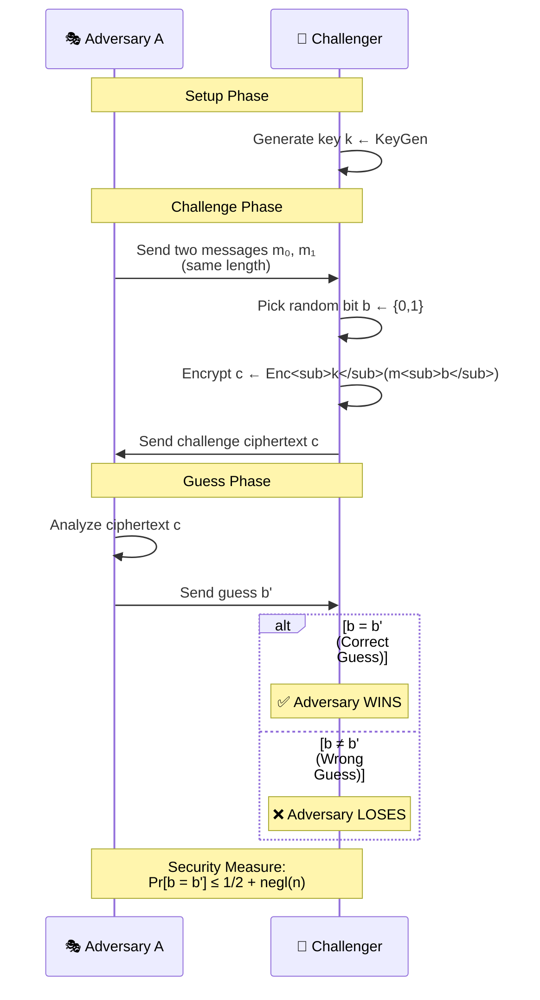

### 🎯 IND Game Security Spectrum


| Notation            | Name                 | Description                                               |
| ------------------- | -------------------- | --------------------------------------------------------- |
| **A**               | Adversary            | The attacker trying to break the encryption scheme        |
| **D**               | Distinguisher        | Algorithm trying to distinguish between two distributions |
| **m₀, m₁**          | Message pair         | Two messages adversary wants to distinguish between       |
| **\|m₀\| = \|m₁\|** | Equal length         | Messages must have same length                            |
| **b ← {0,1}**       | Random bit           | Randomly choose 0 or 1 (coin flip)                        |
| **c ← Encₖ(mᵦ)**    | Challenge ciphertext | Encrypt message corresponding to random bit b             |
| **b'**              | Adversary's guess    | Adversary's guess for which message was encrypted         |
| **b = b'**          | Correct guess        | Adversary wins if guess matches actual bit                |

---

## 🔐 PRG-Based Encryption Scheme

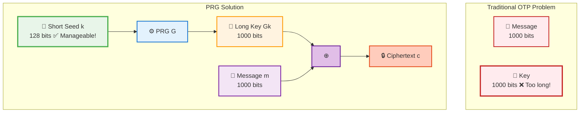

### 💡 Key Advantage

<div align="center">

|      Traditional OTP       |      PRG-Based Encryption      |
| :------------------------: | :----------------------------: |
| 🔑 Key size = Message size |  🌱 Key size << Message size   |
|       ❌ Impractical       |          ✅ Practical          |
|    🛡️ Perfect Security     |   💻 Computational Security    |
| Key: 1 GB for 1 GB message | Key: 128 bits for 1 GB message |

</div>

| Expression             | Name           | Description                                |
| ---------------------- | -------------- | ------------------------------------------ |
| **Encₖ(m) = m ⊕ G(k)** | PRG encryption | Message XORed with PRG expansion of key    |
| **Decₖ(c) = c ⊕ G(k)** | PRG decryption | Ciphertext XORed with PRG expansion of key |
| **k ∈ {0,1}ⁿ**         | Short key      | Key of length n (shorter than message)     |
| **m ∈ {0,1}ℓ⁽ⁿ⁾**      | Long message   | Message of length ℓ(n) (longer than key)   |

---

## ⚙️ Algorithms and Complexity

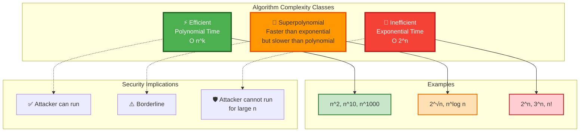

### 📊 Complexity Growth Visualization

<div align="center">

|  n  | Polynomial (n²) | Superpolynomial (2^√n) | Exponential (2ⁿ) |
| :-: | :-------------: | :--------------------: | :--------------: |
| 10  |       100       |          ~32           |      1,024       |
| 20  |       400       |         ~1,048         |    1,048,576     |
| 64  |      4,096      |          256           |  **2⁶⁴** ≈ 10¹⁹  |
| 128 |     16,384      |         65,536         | **2¹²⁸** ≈ 10³⁸  |

> 💡 **Key Insight:** Exponential functions grow **so fast** that even supercomputers can't compute them for n ≥ 128!

</div>

| Notation      | Name               | Description                                                |
| ------------- | ------------------ | ---------------------------------------------------------- |
| **A(x)**      | Algorithm on input | Algorithm A running on input x                             |
| **p(n)**      | Polynomial bound   | Running time bounded by polynomial p(n)                    |
| **2ⁿ**        | Exponential time   | Exponential running time (infeasible for large n)          |
| **2^√n**      | Superpolynomial    | Larger than any polynomial but not necessarily exponential |
| **n^(log n)** | Superpolynomial    | Grows faster than any polynomial                           |
| **O(p(n))**   | Big-O notation     | Running time is at most polynomial p(n) up to constants    |

---

## 📉 Negligible Functions

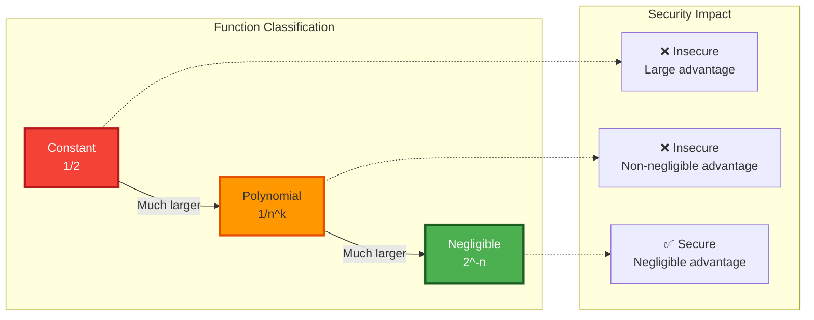

### 🔍 Understanding Negligible Functions

> **Definition:** A function $f(n)$ is **negligible** if for every polynomial $p(n)$, there exists an $N$ such that for all $n > N$:
>
> $$f(n) < \frac{1}{p(n)}$$

<table>
<tr>
<td width="33%" align="center" bgcolor="#c8e6c9">

**✅ Negligible**

- $2^{-n}$
- $2^{-\sqrt{n}}$
- $n^{-\log n}$

</td>
<td width="33%" align="center" bgcolor="#ffccbc">

**❌ NOT Negligible**

- $\frac{1}{n}$
- $\frac{1}{n^{100}}$
- $\frac{1}{n^{1000000}}$

</td>
<td width="33%" align="center" bgcolor="#e3f2fd">

**🎯 Practical Example**

- $n = 128$
- $2^{-128} \approx 10^{-39}$
- $\frac{1}{128^{2}} \approx 0.00006$

</td>
</tr>
</table>

| Expression        | Name                    | Description                                                    |
| ----------------- | ----------------------- | -------------------------------------------------------------- |
| **negl(n)**       | Negligible function     | Function smaller than 1/p(n) for all polynomials p and large n |
| **f(n) < 1/p(n)** | Negligibility condition | For all polynomials p, eventually f(n) becomes smaller         |
| **2⁻ⁿ**           | Exponentially small     | Classic example of negligible function                         |
| **1/2ⁿ**          | Inverse exponential     | Another way to write 2⁻ⁿ                                       |
| **1/n¹⁰⁰**        | Non-negligible          | This is NOT negligible (it's polynomial)                       |

---

## 🔄 Reduction Proof Notation

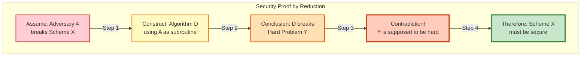

### 🎯 Reduction Example: PRG Security → Encryption Security

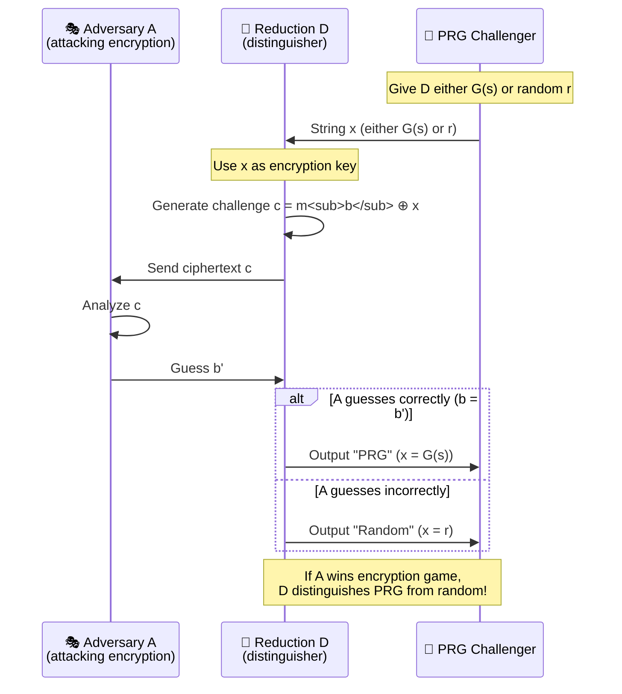

> **💡 Key Insight:** If someone can break the encryption, they can also break the PRG. Since PRG is secure, encryption must be secure too!

| Expression                           | Name                    | Description                                            |
| ------------------------------------ | ----------------------- | ------------------------------------------------------ |
| **"If A breaks X, then D breaks Y"** | Reductionist proof      | Proof by contradiction showing security                |
| **A wins IND → D breaks PRG**        | Reduction implication   | If adversary wins, distinguisher succeeds              |
| **Pr[D(G(s)) = 1]**                  | Distinguisher on PRG    | Probability D outputs 1 when given PRG output          |
| **Pr[D(r) = 1]**                     | Distinguisher on random | Probability D outputs 1 when given truly random string |

---

## ⚡ Common Operations

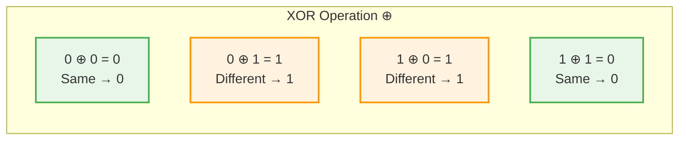

### 🎲 XOR Truth Table

<div align="center">

|  A  |  B  | A ⊕ B | Explanation   |
| :-: | :-: | :---: | :------------ |
|  0  |  0  | **0** | Both same → 0 |
|  0  |  1  | **1** | Different → 1 |
|  1  |  0  | **1** | Different → 1 |
|  1  |  1  | **0** | Both same → 0 |

</div>

| Operation         | Symbol | Example         | Result                   |
| ----------------- | ------ | --------------- | ------------------------ |
| **XOR**           | ⊕      | 0 ⊕ 0           | 0                        |
| **XOR**           | ⊕      | 0 ⊕ 1           | 1                        |
| **XOR**           | ⊕      | 1 ⊕ 1           | 0                        |
| **Sampling**      | ←      | k ← {0,1}ⁿ      | k is random n-bit string |
| **Concatenation** | \|\|   | s\|\|b          | Append b to s            |
| **Equality**      | =      | \|m₀\| = \|m₁\| | Lengths are equal        |

---

## 🔑 Key Properties

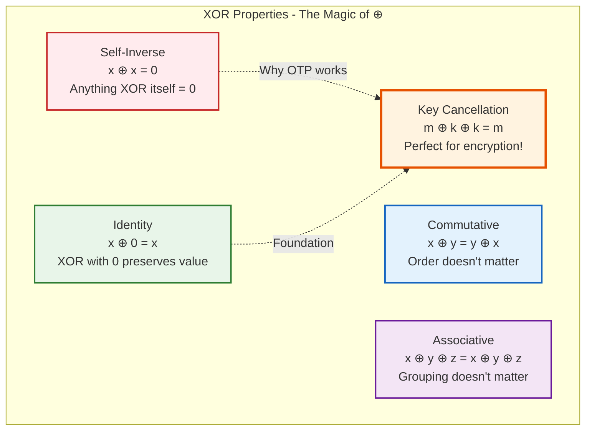

### 🎯 XOR in Action: Encryption & Decryption

<table>
<tr>
<td width="50%">

**🔐 Encryption**

```
Message:  m = 10110101
Key:      k = 11001100
              ⊕
             ─────────
Cipher:   c = 01111001
```

</td>
<td width="50%">

**🔓 Decryption**

```
Cipher:   c = 01111001
Key:      k = 11001100
              ⊕
             ─────────
Message:  m = 10110101
```

</td>
</tr>
<tr>
<td colspan="2" align="center">

**✨ Magic: m ⊕ k ⊕ k = m**

The key cancels itself out perfectly!

</td>
</tr>
</table>

| Property             | Expression                | Meaning                       |
| -------------------- | ------------------------- | ----------------------------- |
| **XOR Self-Inverse** | x ⊕ x = 0                 | XORing with itself gives 0    |
| **XOR Identity**     | x ⊕ 0 = x                 | XORing with 0 gives x         |
| **XOR Commutative**  | x ⊕ y = y ⊕ x             | Order doesn't matter          |
| **XOR Associative**  | (x ⊕ y) ⊕ z = x ⊕ (y ⊕ z) | Grouping doesn't matter       |
| **Key Cancellation** | (m ⊕ k) ⊕ k = m           | Key cancels out in decryption |

---

## 🎮 Security Game Outcomes

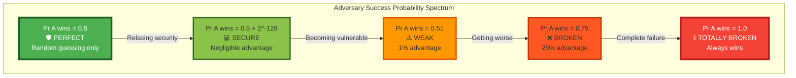

### 📊 Security Interpretation Guide

<div align="center">

|  Pr[A wins]   |   Security Level    | Interpretation                      |    Action    |
| :-----------: | :-----------------: | :---------------------------------- | :----------: |
|     = 0.5     |   🛡️ **Perfect**    | Adversary learns nothing            |    ✅ Use    |
| ≤ 0.5 + 2⁻¹²⁸ |    💻 **Secure**    | Computationally infeasible to break |    ✅ Use    |
| = 0.5 + 1/n²  |     ⚠️ **Weak**     | Non-negligible polynomial advantage | ❌ Don't use |
|     = 0.6     |    ❌ **Broken**    | 10% advantage is huge!              | 🚫 Never use |
|     = 1.0     | 💀 **Catastrophic** | Adversary always wins               | 🔥 Disaster  |

</div>

| Expression                     | Meaning                  | Security Implication                          |
| ------------------------------ | ------------------------ | --------------------------------------------- |
| **Pr[A wins] = 1/2**           | Random guessing          | Perfect security - adversary learns nothing   |
| **Pr[A wins] = 1/2 + negl(n)** | Nearly random            | Computational security - negligible advantage |
| **Pr[A wins] = 1/2 + 1/p(n)**  | Non-negligible advantage | Insecure - adversary has polynomial advantage |
| **Pr[A wins] = 1**             | Always wins              | Completely broken - no security               |

---

## 🕵️ Attack Models

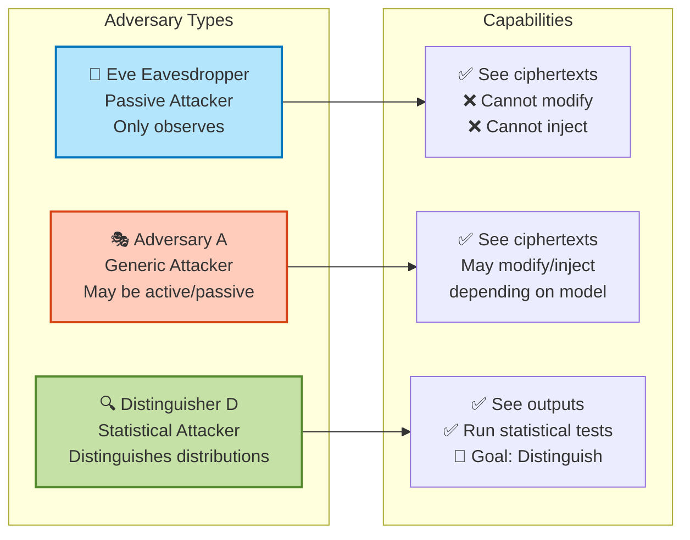

| Symbol  | Name          | Description                                       |
| ------- | ------------- | ------------------------------------------------- |
| **Eve** | Eavesdropper  | Passive adversary who observes ciphertexts        |
| **A**   | Adversary     | Generic attacker (may be passive or active)       |
| **D**   | Distinguisher | Adversary trying to distinguish two distributions |

---

## 💡 Practical Examples

### Example 1: OTP Encryption 🔐

<table>
<tr>
<td>

```
Step 1: Start with message and key
Message: m = 10110101
Key:     k = 11001100

Step 2: XOR bit by bit
Position:    1 2 3 4 5 6 7 8
Message m:   1 0 1 1 0 1 0 1
Key k:       1 1 0 0 1 1 0 0
            ⊕─────────────────
Cipher c:    0 1 1 1 1 0 0 1

Result: c = 01111001
```

</td>
<td>

```
Step 1: Start with ciphertext and key
Cipher:  c = 01111001
Key:     k = 11001100

Step 2: XOR to decrypt
Position:    1 2 3 4 5 6 7 8
Cipher c:    0 1 1 1 1 0 0 1
Key k:       1 1 0 0 1 1 0 0
            ⊕─────────────────
Message m:   1 0 1 1 0 1 0 1

Result: m = 10110101 ✅
```

</td>
</tr>
</table>

> **✨ Beautiful Property:** `(m ⊕ k) ⊕ k = m` — The key perfectly cancels itself!

---

### Example 2: PRG Expansion 🌱→🌳

```mermaid
graph LR
    A[Seed s<br/>8 bits<br/>11010011] -->|PRG G| B[Output Gs<br/>16 bits<br/>1101001110010110]

    C[Input Space<br/>{0,1}^8<br/>Size: 2^8 = 256] -.->|G maps| D[Output Space<br/>{0,1}^16<br/>Size: 2^16 = 65,536]

    style A fill:#fff3e0,stroke:#f57f17,stroke-width:3px
    style B fill:#e8f5e9,stroke:#2e7d32,stroke-width:3px
    style C fill:#e3f2fd,stroke:#1565c0,stroke-width:2px
    style D fill:#f3e5f5,stroke:#6a1b9a,stroke-width:2px
```

<div align="center">

| Property            |   Value   | Note              |
| :------------------ | :-------: | :---------------- |
| 🌱 Seed length      |  8 bits   | Small, manageable |
| 🌳 Output length    |  16 bits  | **Doubled!**      |
| 📊 Expansion factor | ℓ(8) = 16 | 2× expansion      |
| 🔢 Possible seeds   |    256    | 2⁸                |
| 🎯 Possible outputs |  65,536   | 2¹⁶               |

</div>

---

### Example 3: IND Game Success 🎮

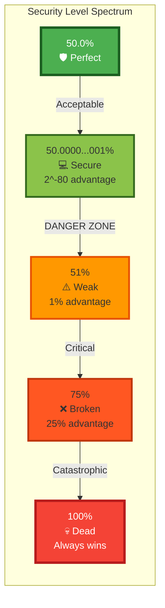

<div align="center">

| Scenario                  | Pr[A wins]  | Decimal  |   Status   | Verdict |
| :------------------------ | :---------: | :------: | :--------: | :-----: |
| **Perfect secrecy (OTP)** |     1/2     |  0.5000  | 🛡️ Perfect |   ✅    |
| **Computational (AES)**   | 1/2 + 2⁻⁸⁰  | ≈ 0.5000 | 💻 Secure  |   ✅    |
| **Weak encryption**       | 1/2 + 1/100 |   0.51   |  ⚠️ Weak   |   ❌    |
| **Broken scheme**         |      1      |   1.0    | 💀 Broken  |   🚫    |

</div>

---

### Example 4: Negligible vs Non-negligible 📉

<table>
<tr>
<td width="50%">

**✅ NEGLIGIBLE Functions**

```
Function: 2^(-n)

n = 10:   2^-10  ≈ 0.001
n = 20:   2^-20  ≈ 0.000001
n = 64:   2^-64  ≈ 10^-19
n = 128:  2^-128 ≈ 10^-39

Growth: Dies VERY fast! ✨
```

</td>
<td width="50%">

**❌ NON-NEGLIGIBLE Functions**

```
Function: 1/n²

n = 10:   1/100    = 0.01
n = 20:   1/400    = 0.0025
n = 64:   1/4096   = 0.000244
n = 128:  1/16384  = 0.000061

Growth: Dies slowly ⚠️
```

</td>
</tr>
</table>

> **💡 Key Insight:** Even $\frac{1}{n^{1000000}}$ is NON-negligible! It's still polynomial, not exponentially small.

---

## 📚 Important Theorems Summary

````mermaid
graph TB
    subgraph "Foundation Theorems"
        T1[Shannon's Theorem<br/>|𝒦| ≥ |ℳ| for perfect secrecy<br/>💎 Key must be as long as message]
        T2[Equivalence Theorem<br/>All perfect secrecy definitions equivalent<br/>🔄 4 definitions = 1 concept]
        T3[PRG Security Theorem<br/>Secure PRG → Secure Encryption<br/>🔗 Reduction proof]
    end

    T1 -->|Limits| P1[❌ OTP impractical<br/>for long messages]
    P1 -->|Motivates| T3
    T2 -.->|Theoretical foundation| T1
    T3 -->|Solution| P2[✅ PRG-based encryption<br/>practical & secure]

    style T1 fill:#ffeb3b,stroke:#f57f17,stroke-width:3px
    style T2 fill:#e3f2fd,stroke:#1565c0,stroke-width:3px
    style T3 fill:#c8e6c9,stroke:#2e7d32,stroke-width:3px
    style P1 fill:#ffcdd2,stroke:#c62828,stroke-width:2px
    style P2 fill:#a5d6a7,stroke:#1b5e20,stroke-width:2px
``` 🎮

````

Message: m = 10110101
Key: k = 11001100
⊕ \***\*\_\_\_\*\***
Cipher: c = 01111001

Decryption:
Cipher: c = 01111001
Key: k = 11001100
⊕ \***\*\_\_\_\*\***
Message: m = 10110101

```

### Example 2: PRG Expansion

```

Seed: s ∈ {0,1}⁸ (8 bits)
PRG: G: {0,1}⁸ → {0,1}¹⁶
Output: G(s) ∈ {0,1}¹⁶ (16 bits)

Expansion factor: ℓ(8) = 16 (doubled the length)

```

### Example 3: IND Game Success

```

Perfect secrecy: Pr[A wins] = 1/2 = 50%
Computational: Pr[A wins] ≤ 1/2 + 2⁻⁸⁰ ≈ 50.0000...%
Weak encryption: Pr[A wins] = 1/2 + 1/100 = 51%
Broken: Pr[A wins] = 1 = 100%

```

### Example 4: Negligible vs Non-negligible

```

Negligible: 2⁻¹²⁸ (negligible for n=128)
Non-negligible: 1/n² (polynomial, not negligible)
Very small: 1/n¹⁰⁰⁰⁰ (still polynomial!)
Super small: 2⁻ⁿ (truly negligible)

````

---

## Important Theorems Summary

| Theorem                 | Statement                                         | Implication                                |
| ----------------------- | ------------------------------------------------- | ------------------------------------------ |
| **Shannon's Theorem**   | \|𝒦\| ≥ \|ℳ\| for perfect secrecy                 | Key must be as long as message             |
| **Equivalence Theorem** | Definitions 1-4 of perfect secrecy are equivalent | All perfect secrecy notions are the same   |
| **PRG Security**        | If G is PRG, then PRG-encryption is IND-secure    | Pseudorandomness implies secure encryption |

---

## 🚀 Quick Reference: Common Patterns

```mermaid
graph TB
    subgraph "Pattern Types"
        P1[📊 Probability Comparison]
        P2[🎲 Random Sampling]
        P3[🔄 Function Mapping]
        P4[🛡️ Security Bound]
    end

    P1 --> E1["Pr[event₁] - Pr[event₂] ≤ negl(n)<br/>≈ Indistinguishability"]
    P2 --> E2["k ← {0,1}ⁿ<br/>≈ Random selection"]
    P3 --> E3["f: A → B<br/>≈ Domain to range"]
    P4 --> E4["Pr[A wins] ≤ 1/2 + negl(n)<br/>≈ Computational security"]

    style P1 fill:#e3f2fd,stroke:#1565c0,stroke-width:2px
    style P2 fill:#f3e5f5,stroke:#6a1b9a,stroke-width:2px
    style P3 fill:#fff3e0,stroke:#e65100,stroke-width:2px
    style P4 fill:#c8e6c9,stroke:#2e7d32,stroke-width:2px
````

### 📋 Pattern Quick Reference

<table>
<tr>
<td width="50%">

**Pattern 1: Probability Comparison**

```
|Pr[event₁] - Pr[event₂]| ≤ negl(n)
```

**Meaning:** Two events are computationally indistinguishable

**Use case:** Proving two distributions look the same

</td>
<td width="50%">

**Pattern 2: Sampling**

```
k ← {0,1}ⁿ
```

**Meaning:** Sample k uniformly at random from n-bit strings

**Use case:** Key generation, randomization

</td>
</tr>
<tr>
<td width="50%">

**Pattern 3: Function Domain/Range**

```
f: A → B
```

**Meaning:** Function f maps elements from set A to set B

**Use case:** Defining encryption, PRG, hash functions

</td>
<td width="50%">

**Pattern 4: Security Bound**

```
Pr[adversary succeeds] ≤ 1/2 + negl(n)
```

**Meaning:** Adversary can't do much better than random guessing

**Use case:** Proving computational security

</td>
</tr>
</table>

---

## 📖 Notation Usage Examples

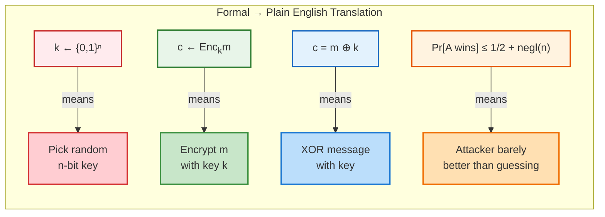

<div align="center">

| Concept 🎯               |        Formal Notation 📐         | Plain English 💬                              |
| :----------------------- | :-------------------------------: | :-------------------------------------------- |
| **Key generation**       |           `k ← {0,1}ⁿ`            | Choose k randomly from all n-bit strings      |
| **Encryption**           |           `c ← Encₖ(m)`           | Encrypt message m with key k to get c         |
| **XOR operation**        |            `c = m ⊕ k`            | XOR message with key bit-by-bit               |
| **Security**             |   `Pr[A wins] ≤ 1/2 + negl(n)`    | Adversary can't win much better than guessing |
| **PRG expansion**        |       `G: {0,1}ⁿ → {0,1}²ⁿ`       | G doubles the input length                    |
| **Indistinguishability** | `\|Pr[D(x)=1] - Pr[D(y)=1]\| ≤ ε` | D can't distinguish x from y                  |

</div>

---

## 💡 Study Tips

```mermaid
mindmap
  root((🎓 Study<br/>Strategy))
    XOR ⊕
      ::icon(fa fa-plus)
      Appears everywhere!
      Memorize properties
      Self-inverse: x⊕x=0
      Identity: x⊕0=x
    Sampling ←
      ::icon(fa fa-random)
      Means random selection
      Or assignment
      k ← {0,1}ⁿ
    Probability Pr
      ::icon(fa fa-percent)
      Always probability of event
      Conditional: Pr[A|B]
      Over keys: Pr_k[event]
    Negligible negl(n)
      ::icon(fa fa-chart-line-down)
      So small we ignore it
      Smaller than any polynomial
      2^-n is negligible
    PPT
      ::icon(fa fa-clock)
      Realistic algorithm
      Polynomial time
      Can use randomness
    Security Level
      ::icon(fa fa-shield)
      1/2 = perfect
      1/2 + negl(n) = secure
      1/2 + 1/poly(n) = broken
```

<div align="center">

### 🎯 Top 6 Things to Remember

|  #  | Concept         | Key Point                                     |     Remember This!     |
| :-: | :-------------- | :-------------------------------------------- | :--------------------: |
| 1️⃣  | **XOR (⊕)**     | Appears everywhere - memorize its properties! |    `m ⊕ k ⊕ k = m`     |
| 2️⃣  | **← arrow**     | Means "sample randomly" or "assign"           |      `k ← {0,1}ⁿ`      |
| 3️⃣  | **Pr[·]**       | Always means probability of something         |      `Pr[A wins]`      |
| 4️⃣  | **negl(n)**     | Means "so small we don't care"                |     `< 1/poly(n)`      |
| 5️⃣  | **PPT**         | Means "realistic computer algorithm"          |    Polynomial time     |
| 6️⃣  | **1/2 + small** | Means "barely better than guessing"           | Computational security |

</div>

---

## ⚠️ Common Mistakes to Avoid

```mermaid
graph TB
    subgraph "❌ Wrong Assumptions"
        W1[1/n is negligible]
        W2[Pr[A wins] = 0.5 is bad]
        W3[OTP key can be reused]
        W4[|𝒦| < |ℳ| for perfect secrecy]
    end

    subgraph "✅ Correct Understanding"
        C1[1/n is NOT negligible<br/>It's polynomial!]
        C2[Pr[A wins] = 0.5 is perfect!<br/>Adversary learns nothing]
        C3[OTP key CANNOT be reused<br/>Breaks security completely]
        C4[|𝒦| ≥ |ℳ| required<br/>Shannon's theorem]
    end

    W1 -.->|Correction| C1
    W2 -.->|Correction| C2
    W3 -.->|Correction| C3
    W4 -.->|Correction| C4

    style W1 fill:#ffcdd2,stroke:#c62828,stroke-width:2px
    style W2 fill:#ffcdd2,stroke:#c62828,stroke-width:2px
    style W3 fill:#ffcdd2,stroke:#c62828,stroke-width:2px
    style W4 fill:#ffcdd2,stroke:#c62828,stroke-width:2px
    style C1 fill:#c8e6c9,stroke:#2e7d32,stroke-width:2px
    style C2 fill:#c8e6c9,stroke:#2e7d32,stroke-width:2px
    style C3 fill:#c8e6c9,stroke:#2e7d32,stroke-width:2px
    style C4 fill:#c8e6c9,stroke:#2e7d32,stroke-width:2px
```

<div align="center">

| Wrong ❌                            | Correct ✓                          | Explanation                       |
| :---------------------------------- | :--------------------------------- | :-------------------------------- |
| `1/n` is negligible                 | `1/n` is **NOT** negligible        | It's polynomial, not negligible   |
| `Pr[A wins] = 0.5` is bad           | `Pr[A wins] = 0.5` is **perfect!** | Means adversary learns nothing    |
| OTP key can be reused               | OTP key **CANNOT** be reused       | Reuse breaks security completely  |
| `\|𝒦\| < \|ℳ\|` for perfect secrecy | `\|𝒦\| ≥ \|ℳ\|` required           | Shannon's theorem                 |
| `1/n¹⁰⁰⁰` is negligible             | `1/n¹⁰⁰⁰` is **NOT** negligible    | Still polynomial!                 |
| PRG output is truly random          | PRG output is **pseudorandom**     | Computationally indistinguishable |

</div>

---

<div align="center">

## 🎉 **End of Cheat Sheet** 🎉

### Quick Navigation

[🔝 Back to Top](#-cs716-data-security---mathematical-notation-cheat-sheet) | [📊 Quick Reference](#-quick-reference-table) | [🎯 Encryption Overview](#-encryption-scheme-overview) | [🛡️ Perfect Secrecy](#️-perfect-secrecy-definitions) | [💻 Computational Security](#-computational-security)

---

**📚 Created for CS716 - Data Security**

_Master the notation, master the concepts!_

🔐 Happy Studying! 🚀

---

</div>
